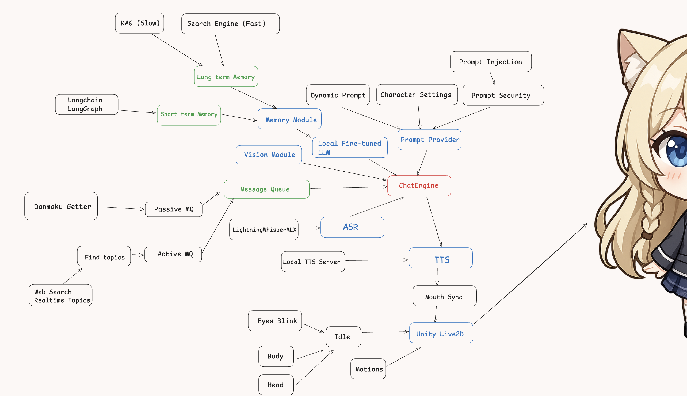

# AIVTuber

**AI-powered Real-time Virtual Streamer (VTuber) System**  
An architecture combining LLM, ASR, TTS, and Live2D animation to create an intelligent and interactive virtual streamer, capable of real-time conversation, proactive topic generation, and live audience interaction.



---

## ✨ Features

- 🎤 **Realtime ASR**
  - Low-latency speech recognition with LightningWhisperMLX

- 🧠 **LLM-based Chat Engine**
  - LangGraph-powered conversational flow
  - Short-term and long-term memory (RAG + search-based memory)
  - Dynamic prompt assembly with character settings and prompt security

- 💬 **Message Queue System**
  - **Passive MQ**: real-time danmaku (live chat) ingestion
  - **Active MQ**: proactive topic generation (web search + topic modeling)

- 🗣 **Realtime TTS**
  - Local TTS server with streaming playback
  - Mouth sync for accurate animation

- 🎞 **Live2D Animation**
  - Unity-driven Live2D character animation
  - Eyes, facial expressions, body, and motion control

- 👁 **Vision Module (In progress)**
  - Future support for multi-modal understanding and vision input

---

## 🛠 Tech Stack

- **LangChain / LangGraph**: LLM orchestration & memory management
- **Local LLM**: Llama.cpp
- **LightningWhisperMLX**: local ASR engine
- **Local TTS Server**: low-latency TTS
- **Unity + Live2D**: animation and rendering
- **Message Queue**: internal decoupled MQ system
- **WebSocket**: module communication & streaming interface

---

## 🚀 Architecture Overview

```plaintext
RAG + Search → Long-term Memory
LangGraph → Short-term Memory → ChatEngine
ChatEngine ← Message Queue (Passive/Active)
ChatEngine → TTS → Live2D
ChatEngine → ASR
ChatEngine → Vision Module
